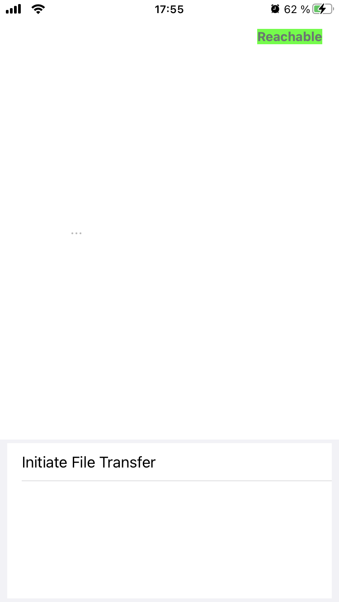
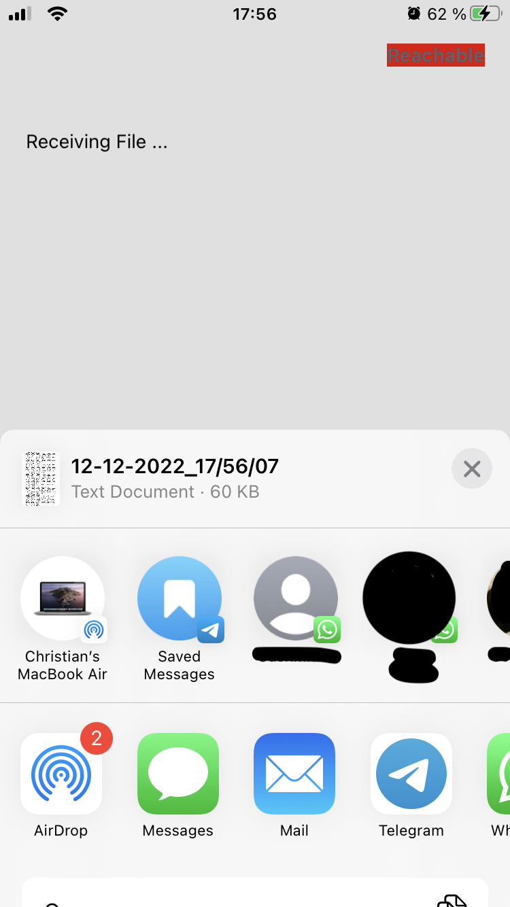
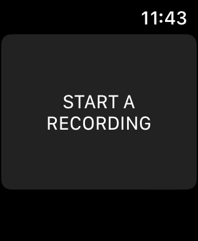
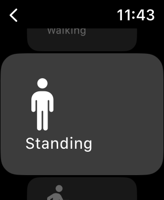
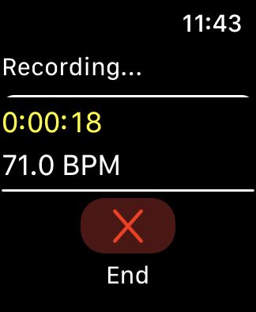
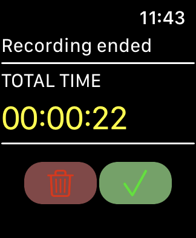

# Sensor Data Recording App for iOS

This project contains an Apple Watch app and an iOS companion app to record sensor data from the watch's accelerometer, gyroscope, magnetometer and heart rate sensor. The recording frequency is set to 100 Hz but can be adjusted as desired. 

## iOS App Usage

When the app is launched, the user is presented with the start screen shown below. In the upper right corner, a text box indicates whether communication with the Watch app is possible. The text is highlighted in red or green, with green indicating that communication can take place. In the lower part of the app is a box with a button to start the data transfer. Above this box is a text field that provides the user with necessary information, for example, if communication with the Watch app is not possible or an unexpected error has occurred. 

    

After a successful data transfer, a view for saving or forwarding the data is opened, which is depicted below. In this view, it is possible to save the file on the device or forward it directly via email or a messenger service.

    

## Apple Watch App Usage

When launching the Watch app, the user is first presented with a simple button as shown below. 

    

After the button is pressed, a predefined set of activities is presented in the form of a vertical carousel. To select an activity for recording, the user has to swipe via touch control through the carousel and press on the respective activity. The list of activities can of course be changed as desired. Depending on which activity is selected, the collected data is annotated accordingly.

    

After an activity is selected, the workout and the associated data recording begins. As shown below, during a recording, the user is shown the current recording time and heart rate. The recording can be stopped at any time via a dedicated button. 

    

After the end of the recording, the total recording time is presented and the user has the option to save or discard the data. This screen is depicted below. If the button with the trash can is selected, the collected data will be discarded and the user will return to the start screen, from which a new recording can then be started. The user also returns to the home screen when the green check mark is selected. In this case, however, the recorded data is saved in a file on the Watch. This file is transferred to the iPhone when this is initiated in the iPhone app. If a new recording is started before the file was transferred to the iPhone, the newly recorded data will be appended to the previously created file. The data is therefore not discarded.

    

